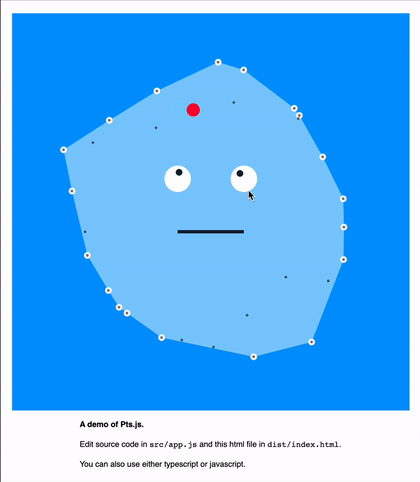

# pts-starter-kit



This is a sample app to help you get started with **[Pts.js](https://ptsjs.org)**. Pts supports both javascript (.js) and typescript (.ts). Here we use `esbuild` to give you smaller file size at faster build speed — This demo is about ~86kb minified and ~26kb gzipped.

If you prefer to use Pts without build steps, you can also link it directly using a CDN like [cndjs](https://cdnjs.com/libraries/pts) or [unpkg](https://unpkg.com/pts/dist/pts.min.js). For example:    
```html
<script type="text/javascript" src="https://unpkg.com/pts/dist/pts.min.js"></script>
```

And you can also try out Pts without any setup using the [live demo editor](http://ptsjs.org/demo/edit/?name=polygon.convexHull). 

Pts is a library for visualizaton and creative coding. Learn more at
[https://ptsjs.org](https://ptsjs.org).

## Getting npm and yarn
1. **npm** is a package manager for Node, and it comes with Node installation. 
   If you don't have Node yet, [download it here](https://nodejs.org/).
2. **yarn** is an alternative to npm. Run `npm i -g yarn` to install, or [see here](https://yarnpkg.com/docs/install/) for more
   installation options. Skip this step if you would rather just use npm.

## Install
1. Clone or download this repo.
2. Go to the folder in terminal, and run `yarn` (or `npm install`) to install the dependencies.

## Run
3. Run `yarn start` (or `npm start`) to start.
4. Open `localhost:8000` and you should see your app running like the image above
5. Edit `src/app.js` to make changes to the sample app

## Building for production
Run `yarn build` (or `npm run build`). 

Note that the Pts library uses es6 features such as extending built-in classes like Array.

## Future Improvements
- Please [file an issue](https://github.com/williamngan/pts-starter-kit/issues)
if you have suggestions or encounter errors.

## License
Apache 2.0 License. See [LICENSE](./LICENSE.md) file.
